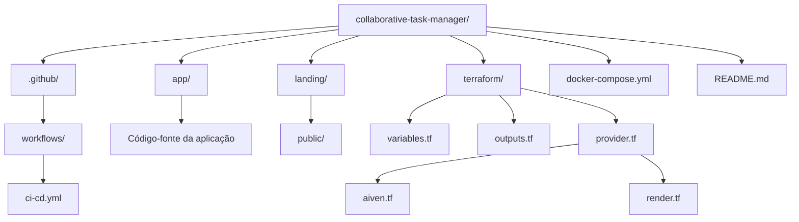

# Collaborative Task Manager - DevOps Lifecycle

Projeto desenvolvido pela Squad 1 durante o Bootcamp de DevOps da Atlântico Avanti. O objetivo principal foi implementar um ecossistema completo de entrega contínua, conteinerização e infraestrutura como código para uma aplicação colaborativa de gerenciamento de tarefas.

## Integrantes
* Keila Silva
* Jéssica Dourado
* Jax Rocha

---

## Arquitetura e Tecnologias

* **Aplicação Backend:** PHP (Apache) com MySQL
* **Landing Page:** HTML5, CSS3 e JavaScript
* **Controle de Versão:** Git & GitHub
* **Conteinerização:** Docker & Docker Compose
* **Infraestrutura como Código (IaC):** Terraform
* **Banco de Dados Gerenciado:** Aiven (MySQL Service)
* **Plataforma de Hospedagem:** Render (API) & Netlify (Landing Page)
* **Integração e Entrega Contínua (CI/CD):** GitHub Actions
---

## Estrutura do Repositório


---

## Pilares DevOps e Práticas Implementadas

### 1. Framework CALMS
* Culture: Colaboração ativa entre os membros da squad em um fluxo compartilhado sem silos técnicos.
* Automation: Automação de testes, builds de imagens e provisionamento de infraestrutura.
* Lean: Ciclos rápidos de entrega com redução de esforço manual em deploys.
* Measurement: Validação automatizada de status de pipelines e logs de execução.
* Sharing: Repositório documentado e padronização de ambientes de desenvolvimento local.

### 2. As Três Maneiras de Gene Kim
* Primeira Maneira (Acelerar o Fluxo): Automação da transição entre o código-fonte (Git) até o deploy automatizado no Render.
* Segunda Maneira (Amplificar o Feedback): Feedback imediato de quebras de compilação ou testes através das etapas de CI no GitHub Actions.
* Terceira Maneira (Aprendizado Contínuo): Criação de rotinas reproduzíveis de infraestrutura via Terraform para experimentações seguras.

---

## Como Executar Localmente

### Pré-requisitos
* Git
* Docker e Docker Compose instalados

### Executando com Docker Compose

1. Clone o repositório:
```bash
git clone https://github.com/JessiFlavours/tasks-colaborativas-demoday.git
cd tasks-colaborativas-demoday
```

3. Suba o ambiente de desenvolvimento:
```bash
docker compose up -d --build
```

5. Acesse a aplicação no navegador através do endereço http://localhost:8080.

---

## Infraestrutura como Código (Terraform)

O diretório terraform/ automatiza toda a infraestrutura do projeto: provisiona a instância gerenciada do MySQL na Aiven e realiza o deploy do container da aplicação na plataforma Render.

1. Acesse o diretório de infraestrutura:
```bash
cd terraform
```

3. Inicialize os providers:
```bash
terraform init
```

5. Valide o planejamento de recursos:
```bash
terraform plan
```

7. Aplique o provisionamento:
```bash
terraform apply
```

---

## Pipeline de CI/CD

O pipeline configurado no GitHub Actions executa os seguintes estágios a cada push ou pull request na branch principal:

1. Lint e Validação: Checagem de sintaxe e padrões de código.
2. Build da Imagem: Criação e validação do container Docker.
3. Deploy Automatizado: Gatilho de deploy contínuo integrado à plataforma Render com conexão ao banco Aiven provisionado via Terraform.
